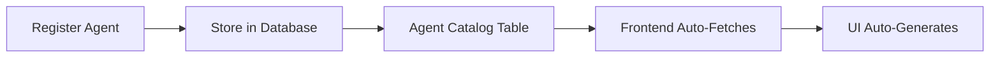

# Agent Registration & Auto-UI Generation System

## Overview

The Abetworks platform features an intelligent agent registration system where **backend agent registration automatically generates the frontend UI** without requiring manual frontend code changes. This document explains how this system works end-to-end.

---

## How It Works: Complete Flow

### 1. Agent Registration (Backend)

When you register a new agent (either via API or the UI registration form), the agent metadata is stored in the database:



#### Registration Methods

**Method A: Via API**
```bash
curl -X POST https://your-app.repl.co/api/agents/register \
  -H "Authorization: Bearer YOUR_JWT_TOKEN" \
  -H "Content-Type: application/json" \
  -d '{
    "id": "custom-sentiment-analyzer",
    "name": "Sentiment Analyzer",
    "type": "nlp",
    "description": "Analyzes text sentiment",
    "category": "analytics",
    "icon": "😊",
    "price": 0
  }'
```

**Method B: Via UI Registration Form**
1. Navigate to **Agent Marketplace** page
2. Click **"Register Agent"** button
3. Fill out the form with agent details
4. Submit → Agent is stored in database

---

### 2. Database Storage

The agent metadata is stored in the `agent_catalog` table:

```sql
CREATE TABLE agent_catalog (
  id VARCHAR PRIMARY KEY,           -- "custom-sentiment-analyzer"
  name TEXT NOT NULL,               -- "Sentiment Analyzer"
  type TEXT NOT NULL,               -- "nlp"
  description TEXT NOT NULL,        -- Short description
  long_description TEXT,            -- Detailed description
  icon TEXT,                        -- "😊"
  category TEXT NOT NULL,           -- "analytics"
  backend_endpoint TEXT,            -- "/api/agents/custom-sentiment-analyzer"
  config_schema TEXT,               -- JSON schema for configuration
  price INTEGER DEFAULT 0,          -- Pricing in USD
  is_active BOOLEAN DEFAULT true,   -- Availability status
  created_at TIMESTAMP DEFAULT NOW()
);
```

**Example Row:**
```json
{
  "id": "custom-sentiment-analyzer",
  "name": "Sentiment Analyzer",
  "type": "nlp",
  "description": "Analyzes text sentiment with 95% accuracy",
  "longDescription": "Advanced NLP model for sentiment analysis...",
  "icon": "😊",
  "category": "analytics",
  "backendEndpoint": "/api/agents/custom-sentiment-analyzer",
  "configSchema": "{\"apiKey\":{\"type\":\"string\",\"required\":true}}",
  "price": 0,
  "isActive": true
}
```

---

### 3. Frontend Auto-Fetches Agent Data

The frontend **automatically fetches** all agents from the database whenever the marketplace page loads:

**File: `client/src/pages/agent-shop.tsx`**
```typescript
const { data: marketplace = [], isLoading } = useQuery<AgentCatalog[]>({
  queryKey: ["/api/agents/marketplace"],
});
```

**What happens:**
1. React component mounts
2. TanStack Query executes `GET /api/agents/marketplace`
3. Backend returns all agents from `agent_catalog` table
4. Frontend stores data in `marketplace` state
5. UI automatically re-renders with new agents

---

### 4. UI Auto-Generates Agent Cards

The frontend uses a **generic card component** that dynamically renders based on agent metadata:

**File: `client/src/pages/agent-shop.tsx` (lines 100-140)**
```typescript
{filteredAgents.map((agent) => {
  const active = isAgentActive(agent.id);
  return (
    <Card key={agent.id} className="hover-elevate cursor-pointer">
      <CardHeader>
        <CardTitle className="flex items-center gap-2">
          {/* Icon from database */}
          <span className="text-2xl">{agent.icon}</span>
          
          {/* Name from database */}
          <span>{agent.name}</span>
        </CardTitle>
        
        {/* Description from database */}
        <CardDescription>{agent.description}</CardDescription>
      </CardHeader>
      
      <CardContent>
        {/* Category badge */}
        <Badge variant="secondary">{agent.category}</Badge>
        
        {/* Price from database */}
        {agent.price > 0 ? (
          <span>${agent.price}/mo</span>
        ) : (
          <span>Free</span>
        )}
      </CardContent>
    </Card>
  );
})}
```

**Key Point:** The card component is **generic** and works for ANY agent. It doesn't have hardcoded agent-specific logic.

---

### 5. Dynamic Configuration Forms

If an agent has a `configSchema`, the system automatically generates a configuration form:

**Example Agent with Config Schema:**
```json
{
  "id": "email-automation",
  "name": "Email Automation",
  "configSchema": {
    "apiKey": {
      "type": "string",
      "required": true,
      "description": "API key for email service"
    },
    "sendingDomain": {
      "type": "string",
      "default": "example.com",
      "description": "Domain for sending emails"
    },
    "maxDailyEmails": {
      "type": "number",
      "default": 100,
      "min": 1,
      "max": 1000
    }
  }
}
```

**Auto-Generated Form Fields:**
- Text input for `apiKey` (required, with description)
- Text input for `sendingDomain` (pre-filled with default)
- Number input for `maxDailyEmails` (with min/max validation)

---

## Complete Registration Flow Diagram

```
┌─────────────────────────────────────────────────────────────────┐
│ STEP 1: Register Agent (API or UI)                              │
│                                                                   │
│  POST /api/agents/register                                       │
│  {                                                                │
│    "id": "my-agent",                                             │
│    "name": "My Custom Agent",                                    │
│    "description": "Does amazing things",                         │
│    "category": "automation"                                      │
│  }                                                                │
└────────────────────┬────────────────────────────────────────────┘
                     │
                     ▼
┌─────────────────────────────────────────────────────────────────┐
│ STEP 2: Backend Stores in Database                               │
│                                                                   │
│  INSERT INTO agent_catalog (id, name, description, ...)          │
│  VALUES ('my-agent', 'My Custom Agent', ...)                     │
└────────────────────┬────────────────────────────────────────────┘
                     │
                     ▼
┌─────────────────────────────────────────────────────────────────┐
│ STEP 3: Frontend Auto-Fetches (on page load)                     │
│                                                                   │
│  useQuery(["/api/agents/marketplace"])                           │
│  → GET /api/agents/marketplace                                   │
│  → Returns: [{ id: "my-agent", name: "My Custom Agent", ... }]  │
└────────────────────┬────────────────────────────────────────────┘
                     │
                     ▼
┌─────────────────────────────────────────────────────────────────┐
│ STEP 4: UI Auto-Renders Agent Card                               │
│                                                                   │
│  ┌─────────────────────────────────────┐                        │
│  │  🤖  My Custom Agent                 │                        │
│  │  ────────────────────────            │                        │
│  │  Does amazing things                 │                        │
│  │                                       │                        │
│  │  [automation]           Free         │                        │
│  │  [Activate]                          │                        │
│  └─────────────────────────────────────┘                        │
└─────────────────────────────────────────────────────────────────┘
```

---

## What You DON'T Need to Create

When adding a new agent, you **DO NOT** need to:

- ❌ Create custom React components
- ❌ Update routing configuration
- ❌ Modify the marketplace page
- ❌ Add hardcoded agent cards
- ❌ Update navigation menus
- ❌ Write custom UI code

---

## What You DO Need to Create

### 1. Backend Implementation

Implement the backend logic that executes when the agent runs:

**File: `server/routes.ts`** (add this route)
```typescript
app.post("/api/agents/my-custom-agent", requireAuth, async (req, res) => {
  try {
    const { input } = req.body;
    
    // Your agent logic here
    const result = await yourCustomLogic(input);
    
    res.json({ success: true, output: result });
  } catch (error) {
    res.status(500).json({ success: false, error: error.message });
  }
});
```

### 2. Python Agent (Optional)

If using Python microservices:

**File: `python-agents/agents/my_agent.py`**
```python
from .base_agent import BaseAgent

class MyCustomAgent(BaseAgent):
    async def execute(self, input_data):
        # Your Python logic here
        return {
            "success": True,
            "output": {"result": "processed data"}
        }
```

**Register in `python-agents/main.py`:**
```python
MODULE_REGISTRY = {
    "nlp_processor": NLPAgent,
    "data_processor": DataAgent,
    "my_custom_agent": MyCustomAgent,  # Add this line
}
```

---

## Agent Activation Flow

Once an agent is registered, users can activate it:

```
┌─────────────────────────────────────────────────────────────────┐
│ User clicks "Activate" on agent card                             │
└────────────────────┬────────────────────────────────────────────┘
                     │
                     ▼
┌─────────────────────────────────────────────────────────────────┐
│ POST /api/agents/:id/activate                                    │
│                                                                   │
│  Creates entry in agent_subscriptions table:                     │
│  {                                                                │
│    orgId: "org_123",                                             │
│    agentId: "my-agent",                                          │
│    status: "active"                                              │
│  }                                                                │
└────────────────────┬────────────────────────────────────────────┘
                     │
                     ▼
┌─────────────────────────────────────────────────────────────────┐
│ Agent now appears in "Active Agents" list                        │
│ User can configure and execute the agent                         │
└─────────────────────────────────────────────────────────────────┘
```

---

## Filtering & Search (Auto-Handled)

The UI automatically handles:

### Search Functionality
```typescript
const filteredAgents = marketplace.filter((agent) => {
  const matchesSearch =
    agent.name.toLowerCase().includes(searchTerm.toLowerCase()) ||
    agent.description.toLowerCase().includes(searchTerm.toLowerCase());
  return matchesSearch;
});
```

### Category Filtering
```typescript
const matchesCategory =
  selectedCategory === "all" || agent.category === selectedCategory;
```

Both work **automatically** for any new agent you register!

---

## Example: Adding a New Agent (Complete Steps)

### Step 1: Register via API
```bash
curl -X POST http://0.0.0.0:5000/api/agents/register \
  -H "Authorization: Bearer YOUR_TOKEN" \
  -H "Content-Type: application/json" \
  -d '{
    "id": "invoice-generator",
    "name": "Invoice Generator",
    "type": "document-automation",
    "description": "Auto-generate professional invoices from data",
    "category": "automation",
    "icon": "📄",
    "backendEndpoint": "/api/agents/invoice-generator",
    "price": 0
  }'
```

### Step 2: Implement Backend Logic
**File: `server/routes.ts`**
```typescript
app.post("/api/agents/invoice-generator", requireAuth, async (req, res) => {
  try {
    const { clientName, items, total } = req.body.input;
    
    // Generate invoice (example logic)
    const invoice = {
      invoiceNumber: Date.now(),
      client: clientName,
      items: items,
      total: total,
      date: new Date().toISOString()
    };
    
    res.json({ success: true, output: invoice });
  } catch (error) {
    res.status(500).json({ success: false, error: error.message });
  }
});
```

### Step 3: Done!

The agent now:
- ✅ Appears in the marketplace
- ✅ Can be activated by users
- ✅ Has a generated card with icon, name, description
- ✅ Is searchable and filterable
- ✅ Can be executed via the UI

---

## Key Takeaways

1. **One Registration → Full UI**: Register once, UI generates automatically
2. **Data-Driven Architecture**: All UI driven by database metadata
3. **Zero Frontend Changes**: Add agents without touching React code
4. **Dynamic Configuration**: Config forms auto-generate from schema
5. **Fully Scalable**: System handles unlimited agents without code changes

---

## Technical Implementation Details

### Frontend Components Involved

**1. Agent Marketplace (`agent-shop.tsx`)**
- Fetches all agents from API
- Renders dynamic grid of agent cards
- Handles search, filtering, activation

**2. Agent Registration Form (`agent-registration-form.tsx`)**
- Modal form for registering new agents
- Validates input and submits to API
- Updates marketplace automatically

**3. Agent Detail Modal**
- Shows full agent information
- Displays configuration schema
- Handles activation

### Backend Endpoints

**1. `POST /api/agents/register`**
- Creates new agent in catalog
- Validates required fields
- Returns created agent object

**2. `GET /api/agents/marketplace`**
- Returns all agents from catalog
- Available to all authenticated users

**3. `POST /api/agents/:id/activate`**
- Creates agent subscription
- Links agent to organization
- Enables agent for use

---

## Debugging & Troubleshooting

### Agent Not Appearing?

1. Check database:
```sql
SELECT * FROM agent_catalog WHERE id = 'your-agent-id';
```

2. Check API response:
```bash
curl http://0.0.0.0:5000/api/agents/marketplace \
  -H "Authorization: Bearer YOUR_TOKEN"
```

3. Check browser console for errors

### Agent Card Not Rendering Correctly?

- Verify all required fields are present (id, name, description, category)
- Check icon is a valid emoji or text
- Ensure category matches one of the predefined categories

---

**Last Updated:** 2024  
**Version:** 1.0
